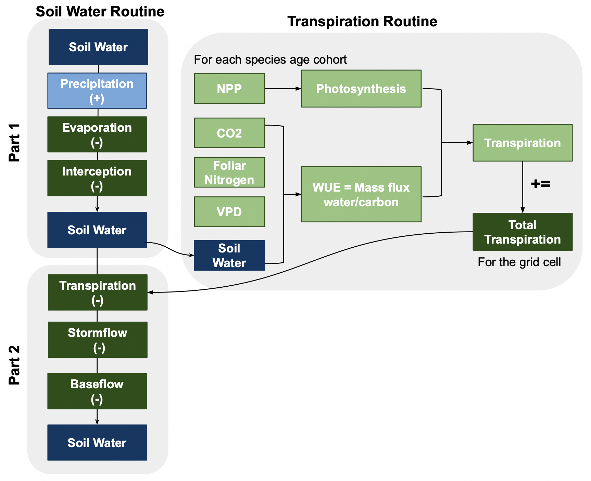

# Extension-NECN-Succession

This fork of the NECN extension includes updates implementing species-specific transpiration calculations.

Description of transpiration algorithm: 
- Transpiration is calculated for each species-age cohort based on theory from the PnET Succession extension that treats it as a pure mass flux ratio based on dynamic climate and water use efficiency (WUE) (de Bruijn et al., 2014)
- Dynamic WUE is calcualted as a function of foliar nitrogen, atmospheric CO2, temperature, and VPD. 
    - Foliar nitrogen is calculated using species specific leaf CN ratios (parameter in original model) and assuming C is 47% of leaf biomass. 
    - VPD calculated using temperature and rH. rH is added to requirements of monthly climate data 
    - Monthly CO2 is added to requirements of monthly climate data
- Gross primary productivity (GPP) is calculated as 2x NPP based on the assumption that autotrophic respiration is half of GPP
- Transpiration is calculated by scaling GPP using WUE. 
- Total transpiration for each cell is calculated by summing transpiration from each cohort in each cell. Using this method, the transpiration reflets species differences in transpiration rates and implicitly includes the effects of competition, age, climate, and water and nutirents because it is based on NPP. 

Changes to NECN to accomodate the new transpiration algorithm: 
- Requires three additional monthly climate variables: CO2, minimum rH, and maximum rH
- Split the soil water sub-model into two parts. Since there was only one value for the whole cell calculated for transpiration in the original model, transpiration was calculated in the middle of the soil water sub-model. In the updated model, transpiration is coupled to NPP, so we needed to split the model into two parts directly before and directly after transpiration is calculated. This way the first part of the soiil water model runs, then NPP and transpiration are calculated for each cohort, and then the total transpiration in the cell is input to the second half of the soil water sub-model. 
    - Soil water sub-model part 1 adds precipitation and subtracts snow melt, interception, and evaporation from the soil water 
    - Soil water sub-model part 2 subtracts transpiration, stormflow, and baseflow
- NPP is based on available water, which is calculated each month as an average of the maximum and minimum water available in the cell. In the orignial model this worked because NPP was calculated after the soil water sub-model ran. But in the updated version, the NPP and transpiration are calculated after part 1 but before part 2, so while there was a current estimte of maximum available water (calculated in p1), there was no current estimate of the minimum available water because that is calculated in pt 2. To work around this, we used the minimum available water from the previous month. 
- To stop transpiration from exceeding plant available water, we allocate plant available water between species-age cohorts based on biomass. Cohort transpiration cannot exceed it's allotted water. 

de Bruijn, A., Gustafson, E. J., Sturtevant, B. R., Foster, J. R., Miranda, B. R., Lichti, N. I., & Jacobs, D. F. (2014). Toward more robust projections of forest landscape dynamics under novel environmental conditions: Embedding PnET within LANDIS-II. Ecological Modelling, 287, 44-57. doi:10.1016/j.ecolmodel.2014.05.004

The next generation NECN, v6.x

The next generation NECN, v6.x

Robert Scheller is the Maintainer of the original NECN repository.